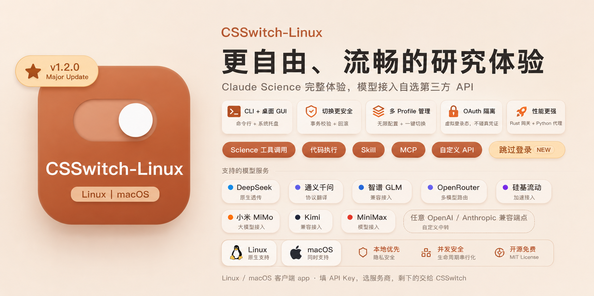

<p align="center">
  
</p>

<p align="center">
  
  
  
  
</p>

<p align="center">
  <a href="./README.md">简体中文</a> ·
  <a href="./README.en.md">English</a>
</p>

# CSSwitch Linux

CSSwitch Linux 是基于 [CSSwitch v0.4.4](https://github.com/SuperJJ007/CSSwitch) 移植的纯 CLI 版本，专为 **Linux、WSL 和无 GUI 设备** 打造。它把 Claude Science 的推理请求转换并接入你自己的模型 API，支持 DeepSeek、通义千问、Kimi、GLM、硅基流动、OpenRouter 或自定义兼容端点。

> 本项目基于 CSSwitch macOS v0.4.4（[SuperJJ007/CSSwitch](https://github.com/SuperJJ007/CSSwitch)）移植。感谢原作者的杰出工作。

## 与 macOS 桌面版的区别

|                              | macOS 桌面版 (v0.4.4)   | Linux CLI 版 (v1.1.0)       |
| ---------------------------- | ------------------------ | ----------------------------- |
| **界面**                     | Tauri 2 菜单栏面板       | 纯 CLI（手写参数解析）        |
| **平台**                     | macOS Apple Silicon      | Linux / WSL / headless         |
| **Science 安装**             | `.app` 应用包            | `npm install -g`               |
| **安装方式**                 | `.dmg` 拖入 Applications | `dpkg -i` / `make install`    |
| **代理注入**                 | 一键启动自动注入         | eval / hook / wrapper 三种方式 |
| **后台运行**                 | 菜单栏常驻               | `csswitch daemon start`        |

## 快速开始

### 前置条件

- Linux x86-64（Ubuntu 20.04+、Debian 11+、RHEL 8+、Arch 等）或 WSL2
- Claude Science CLI（`npm install -g @anthropic-ai/claude-science`）
- 一个可用的第三方模型 API Key

### 安装

**方式一：deb 包（Debian / Ubuntu）**

```bash
curl -LO https://github.com/YuntaoOvO/CSSwitch-Linux/releases/latest/download/csswitch_1.1.0_amd64.deb
sudo dpkg -i csswitch_1.1.0_amd64.deb
```

**方式二：从源码编译**

```bash
git clone https://github.com/YuntaoOvO/CSSwitch-Linux.git
cd CSSwitch-Linux
make && sudo make install
```

### 基本使用

```bash
# 1. 添加配置
csswitch profile add --template deepseek --name "我的DeepSeek" --key sk-xxxxxxxx

# 2. 激活（设为当前生效）
csswitch profile activate <上一步生成的ID>

# 3. 启动后台代理
csswitch daemon start

# 4. 注入环境并运行（三选一）

# A. 手动注入
eval "$(csswitch env)"
claude-science

# B. wrapper 运行
csswitch run -- claude-science "帮我分析代码库"

# C. 安装 shell hook（推荐，一次性设置）
csswitch hook install --shell bash
source ~/.bashrc
# 此后直接运行 claude-science 即可自动代理

# 查看状态
csswitch daemon status
csswitch proxy status

# 环境诊断
csswitch doctor
```

## 命令参考

| 命令                                                 | 说明                          |
| ---------------------------------------------------- | ----------------------------- |
| `csswitch profile list`                              | 列出所有配置                  |
| `csswitch profile add --template --name --key`       | 添加新配置                    |
| `csswitch profile delete <id>`                       | 删除配置                      |
| `csswitch profile activate <id>`                     | 设为当前生效配置              |
| `csswitch profile show [id]`                         | 查看配置详情（key 掩码）      |
| `csswitch proxy start / stop / status`               | 代理控制                      |
| `csswitch daemon start / stop / status`              | 后台 daemon（PID 文件）       |
| `csswitch science start / stop / status`             | Science 沙箱一键管理          |
| `csswitch run -- <cmd> [args]`                       | 注入代理环境执行命令          |
| `csswitch hook install / uninstall --shell <sh>`     | Shell hook 管理               |
| `csswitch env`                                       | 打印代理环境变量（供 eval）   |
| `csswitch doctor`                                    | 只读环境诊断                  |
| `csswitch config`                                    | 显示完整配置（key 掩码）      |

### profile add 完整参数

```bash
csswitch profile add \
  --template deepseek|qwen|glm|kimi|siliconflow|xiaomi|openrouter|custom \
  --name "显示名称" \
  --key sk-xxxxxxxx \
  [--base-url https://...] \   # relay / custom 可选
  [--model model-name]         # relay / custom 可选
```

## 支持的模型来源

| 来源           | 类型     | 模板 ID        | 说明                                     |
| -------------- | -------- | -------------- | ---------------------------------------- |
| DeepSeek       | 国内官方 | `deepseek`     | 原生 Anthropic 兼容，支持 tool-use shim   |
| 通义千问       | 国内官方 | `qwen`         | 代理做 Anthropic ↔ OpenAI 协议转换        |
| 智谱 GLM       | 国内官方 | `glm`          | 原生 Anthropic 兼容端点透传               |
| Kimi（Moonshot）| 国内官方 | `kimi`         | 原生 Anthropic 兼容端点透传               |
| 小米 MiMo      | 国内官方 | `xiaomi`       | 原生 Anthropic 兼容端点透传               |
| 硅基流动       | 国内中转 | `siliconflow`  | relay + model override                    |
| OpenRouter     | 国际中转 | `openrouter`   | relay + model override                    |
| 自定义 Anthropic | 自填   | `custom`       | 适合私有网关、Claude 兼容中转站           |
| 自定义 OpenAI  | 自填   | `custom`       | OpenAI Chat Completions 兼容              |

## 如何保护你的真实账号

- 不复制、读取或修改真实 Claude 登录凭证
- 隔离 Science 使用独立 HOME（`~/.csswitch/sandbox/home`）和独立端口
- 第三方 API Key 保存在 `~/.csswitch/config.json`，文件权限 `0600`
- Key 不显示在日志中，本地网关只监听 `127.0.0.1`

## 开发

```bash
git clone https://github.com/YuntaoOvO/CSSwitch-Linux.git
cd CSSwitch-Linux

# 编译
cargo build --release -p csswitch -p csswitch-gateway

# 测试
cargo test --workspace

# 打包
make deb          # 生成 releases/csswitch_1.1.0_amd64.deb
make install      # 安装到 /usr/local/bin
```

### Workspace 结构

```
├── cli/                       # csswitch CLI（手写 arg parser）
├── crates/
│   ├── csswitch-config/       # 配置读写（~/.csswitch/config.json, v2 schema）
│   ├── csswitch-templates/    # 模板注册表（12 个 provider）
│   ├── csswitch-oauth/        # 虚拟 OAuth 登录（AES-GCM）
│   └── csswitch-runtime/      # 核心运行时（proxy / sandbox / provider / system）
├── desktop/gateway/           # csswitch-gateway（翻译代理 sidecar）
├── desktop/src-tauri/         # 原 macOS 桌面版（保持原样）
└── Makefile                   # build / install / uninstall / deb
```

```
CSSwitch profile
  → csswitch-gateway (Rust 本地网关，协议转换)
  → 隔离 OAuth 登录态
  → Claude Science (npm 全局安装)
  → 注入 ANTHROPIC_BASE_URL + 独立 HOME
```

## 致谢

- [CSSwitch](https://github.com/SuperJJ007/CSSwitch)（SuperJJ007）— 本项目基于其 v0.4.4 macOS 桌面版移植
- [CC Switch](https://github.com/farion1231/cc-switch) — 产品形态参考

## 许可

[MIT](./LICENSE)
